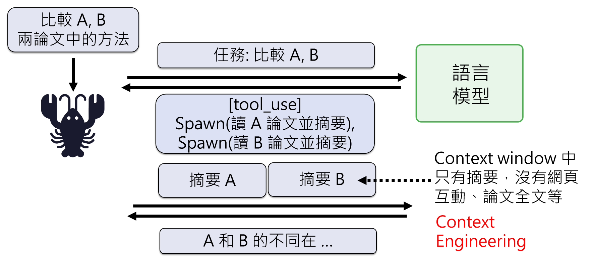
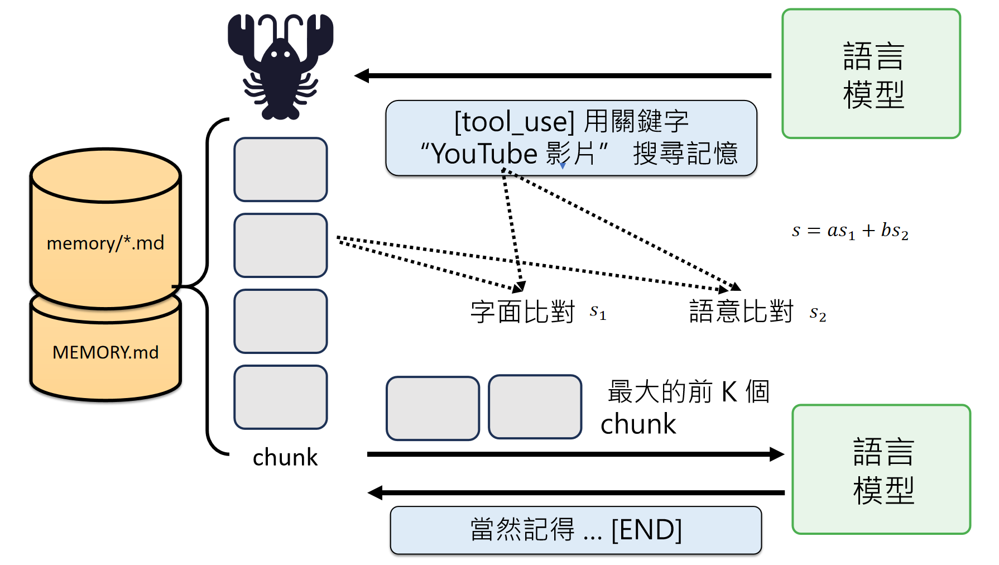
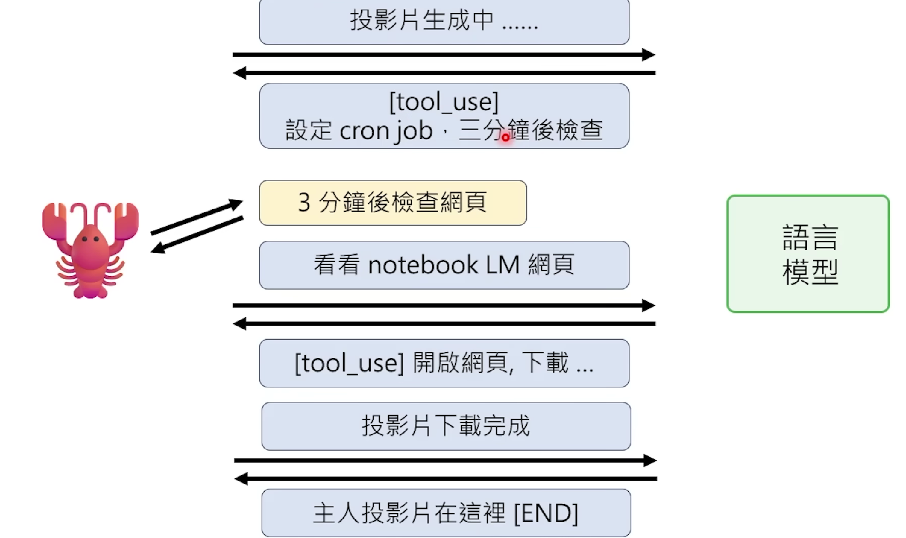

# 第1课：AI Agent 基础

> 解剖小龙虾 — 以 OpenClaw 为例介绍 AI Agent 的运作原理

## 基本概念

### OpenClaw（AI Agent）是什么？

OpenClaw（AI Agent）不是人工智能（语言模型）

### 语言模型

- call：输入（给prompt）
- response：输出（对应call的文字接龙回答）
- Context window：输入+输出的长度，有限

## 如何知道自己是谁

### System Prompt

包含：身份相关（SOUL.md, IDENTITY.md, USER.md, MEMORY.md），使用工具相关，行为相关（AGENT.md）
可以使用的SKILL，记忆相关等

每次call语言模型的prompt上都会附上system prompt -> 无记忆 -> token急剧增加

## 如何用电脑

通过exec执行shell command，即文字指令操控

**安全风险防范**：
1. 通过MEMORY.md（prompt层面，不够保险）
2. 人工核验指令

## 如何使用工具

Agent会自己创建工具

**Sub-agent**：即sessions_spawn（繁殖新的龙虾）

**举例**：

**特点**：
1. 节省上下文 -> context engineering
2. 无sub-sub agent（避免层层外包）

## SKILL

**特点**：是工作的SOP，让语言模型按需读取，system prompt只包含skill的路径

## 如何记忆

### 保存记忆

- 短期记忆 -> 写入memory文件夹里的.md文件
- 长期记忆 -> 写入MEMORY.md

### 获取记忆

跨session（会话）：调用搜索+获取工具，即对记忆的.md文档做RAG

**具体做法**：

## 如何定时工作

### 心跳（HEARTBEAT）机制

龙虾隔一段时间call语言模型，让其阅读HEARTBEAT.md中的任务

### Cron job系统

固定时间通过龙虾让语言模型做某项任务

**作用**：让机器学会等待

**举例**：

**操作方法**：在MEMORY.md中设定

## 如何长时间自主运行

让语言模型压缩历史记录

**具体执行**：摘要、剪枝等多种方式

## 如何安全使用

保证环境安全（安装在新的/格式化后的电脑）

- 教导他（给予安全准则）
- 检查他做了什么（是否写入安全准则、关注过程等）
- 不提供日常使用的账号密码